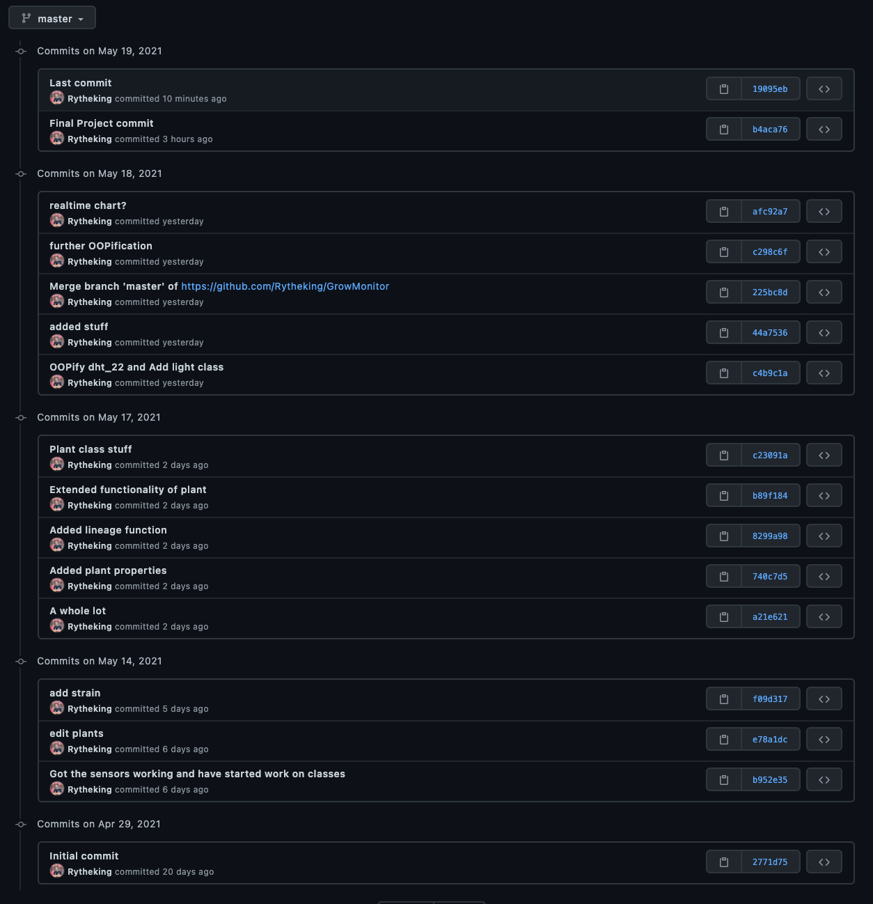
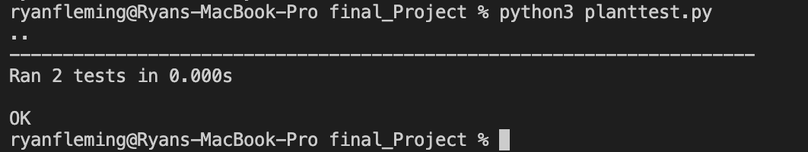

# Final Project: Grow Monitor Email

## Concepts
I created a database that a sensor object updates, and then an email object which is populated by graph objects and information from a plant object

## Commits
Because this is a project I see myself extending in the future I did most of the work in a seperate repo with more extensive work.
This included non OOP elements like a web server and camera streaming
 

## Tests
