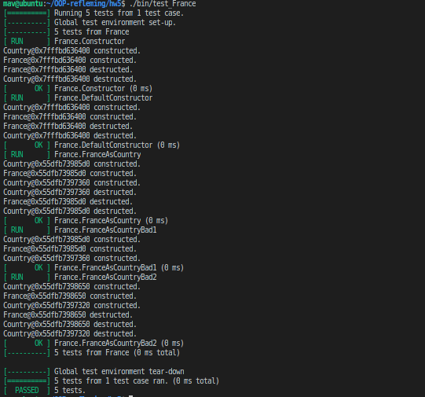
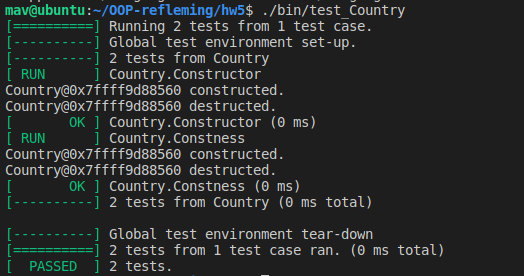

# Simple Object

This is an example of how to construct a simple Object in C++

If you keep the file structure similar to the one below it should be easy to build

```
src/*.cpp
include/*.h
tmp/*.o - temporary object files
lib/*.so - external shared libraries
bin/XXXX - programs built from src/main_XXXX.cpp
bin/test_XXXX - tests built from src/test_XXXX.cpp
```

You can use make clean/all without modifying Makefile and Makefile.googletest


## Build

```bash
make clean
make all
```

## Test

```bash
bin/test_France
bin/test_Country
```

## Run

```bash
bin/france
bin/country
```
## Clean-Build-Test Screen Capture




## References

1. [GNU make tutorial](https://linuxhint.com/gnu-make-tutorial/)
1. [C++ Google Test](https://github.com/google/googletest)
1. [Google Test Primer](https://www.learncpp.com/cpp-tutorial/89-class-code-and-header-files/)
1. [src/include](https://www.learncpp.com/cpp-tutorial/89-class-code-and-header-files/)


# [Py-OO](https://github.com/Rytheking/OOP-refleming/tree/main/hw4)
Expand python object to have relational properties
